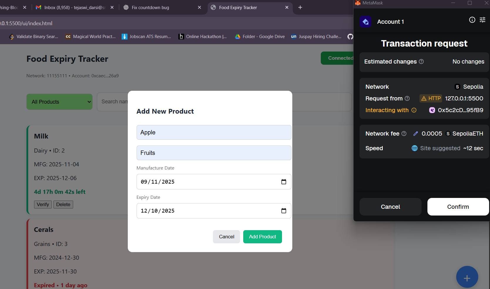

# 🛒 Food Expiry Tracker Using Blockchain  
A decentralized application (DApp) built using **Solidity**, **Web3.js**, and **Ethereum blockchain** to securely track food product expiry dates.  
This system ensures transparency, immutability, and prevents tampering of expiry labels by storing product information on the blockchain.

---

## 🚀 Features

-  Add food products with manufacturing & expiry dates  
-  Verify expiry status on-chain  
-  Live countdown timer showing remaining validity  
-  Shows "Expired • X days ago" or "Expired • HH:MM:SS ago"  
-  Delete product (marks inactive on blockchain)  
-  MetaMask wallet integration  
-  Data stored immutably using Smart Contracts  
-  Frontend built using JavaScript, HTML, CSS  

---

## 🏗️ Tech Stack

### **Frontend**
- HTML  
- CSS  
- JavaScript  
- Web3.js  

### **Blockchain**
- Solidity  
- Ganache / Hardhat  
- MetaMask Wallet  

---

## 📐 System Architecture

User → Frontend (HTML/JS) → Web3.js → Ethereum Blockchain → Smart Contract → Product Data

markdown
Copy code

---

## 📦 Smart Contract Overview

The `FoodExpiry.sol` file includes:

- `struct Product`
- `mapping(uint => Product)`
- Functions:
  - `addProduct()`
  - `deleteProduct()`
  - `verifyProduct()`
  - `getAllProducts()`
- Stores:
  - `productId`
  - product name
  - category  
  - manufacture date  
  - expiry date  
  - status

---

## ⚙️ Installation & Setup

#### **1️⃣ Clone Repository**
```bash
git clone https://github.com/your-username/food-expiry-tracker.git
cd food-expiry-tracker
```
#### **2️⃣ Install Dependencies**
```bash
Copy code
npm install
```
#### **3️⃣ Start Blockchain (Ganache/Hardhat)**
Ganache GUI: Start workspace
OR
Hardhat:

```bash
Copy code
npx hardhat node
```
#### **4️⃣ Deploy Smart Contract**
```bash
Copy code
npx hardhat run scripts/deploy.js --network localhost
```
#### **5️⃣ Run Frontend**
 Open the index.html file in your browser.

-----

## 🔑 MetaMask Configuration

- Install MetaMask

- Add local blockchain network:
```
Network name: Localhost

RPC URL: http://127.0.0.1:8545

Chain ID: 1337
```
- Import private key from Ganache/Hardhat
-----

## 🕒 Expiry Verification Logic

The frontend shows:

Valid Products
```
css
Copy code
5d 10h 24m 15s left
```
 Expired Recently
 ```
powershell
Copy code
Expired • 2h 15m 30s ago
```
 Expired Long Ago
 ```
sql
Copy code
Expired • 4 days ago
Expired • 2 months ago
Expired • 1 year ago
```
Updated every second using JavaScript timers.

-----
## 📸 Screenshots


 |   


----
## 🚧 Future Enhancements
- QR/Barcode scanning

- IPFS for product image storage

- Role-based access (Manufacturer, Retailer, Admin)

- Email/SMS expiry alerts

- Mobile App Version

---
## 🏁 Conclusion
The Food Expiry Tracker demonstrates how blockchain can create a tamper-proof, transparent, and trustworthy food safety system.
This project improves reliability by ensuring expiry information cannot be altered once recorded.

---
## 🤝 Contributors
Tejaswi Darsi – Developer

Open to contributions!
